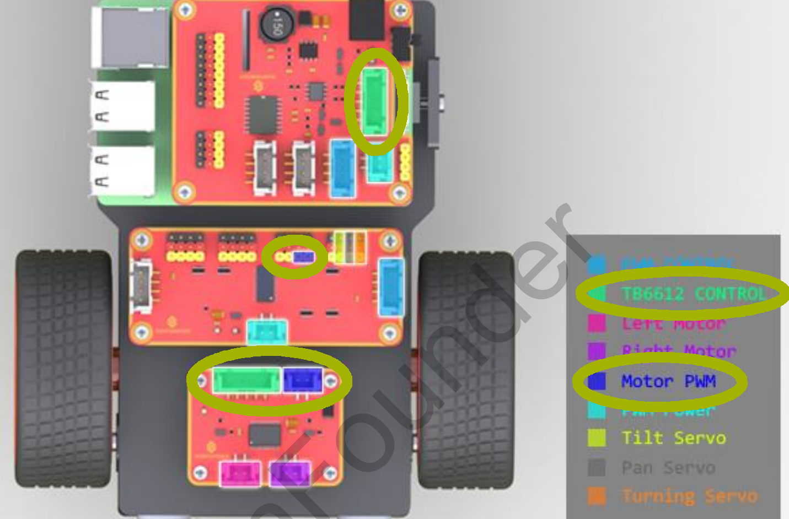

# SunFounder PiCar-V (v2.0)
SunFounder Smart Video Car Kit for Raspberry Pi

[NodeJs](https://nodejs.org) project written in [Typescript](https://www.typescriptlang.org/).

Main dependencies [Johnny-Five](http://johnny-five.io/), [Socket.io](https://socket.io/), [GStreamer](https://gstreamer.freedesktop.org/)

**Disclaimer: I'm not responsible of the use you give to this tutorial
or the consequences during or after following it. Happy Hacking.**

### Preparation of the Car
Follow the original instructions available [here](https://www.sunfounder.com/learn/download/U21hcnRfVmlkZW9fQ2FyX1YyLjBfZm9yX1Jhc3BiZXJyeV9QaV9QaUNhci1WXy5wZGY=/dispi) for assembly
and connections. [Here you have a copy on PDF](Documents/Smart_Video_Car_V2.0_for_Raspberry_Pi_PiCar-V_.pdf) in case the website 
is not available.

Once you are done assembling and are familiarize with your PiCar, we need to change how the _TB6612 Motor Driver_ is connected.

**Why?** 

If we look at the page 22 of the manual, we can see that the _Robot HATS's TB6612 CONTROL_
(green label) is connected to the _TB6612 Motor Driver_ and the _Motor PWM_ (dark blue) 
to the _PCA9685 PWM Driver_ (pins 4 & 5).

Circled in some kind of green we have the important parts we need to focus on.


With the library Johnny-Five we can not use the motors while they are connected this way.
It doesn't support using the board _PCA9685 PWM Driver_ and assign other GPIO pins, in our
case through the _Robot HATS_.

But we can easily control the _TB6612 Motor Driver_ connected only to the _PCA9685 PWM Driver_
thus we need to plug the cables for the direction into the PWM Driver (the power will still come from the _Robot HATS_).

**How?**

On the page 7 of the manual, we can see the cables we have in the car. We are interested in the one
that connects the _Robot HATS_ to the _TB6612 Motor Driver_, the 100mm HX2.54 5-Pin Jumper Wire.


We need to remove the connection of the cables white and yellow to the _Robot HATS_ and instead
connect this two cables to the _PCA9685 PWM Driver_ into the pins 6 & 7. 
So in the end we should have the 5-pin cable connected normally as in the original instructions
but the cables yellow and white (cut in the _Robot HATS's TB6612 CONTROL_ side) connected to 
the _PCA9685 PWM Driver_ (pins 6 & 7). 

What I have done to achieve this is to crimp a two pin female connector to the end of the 
cut cables to easily connect them into the _PCA9685 PWM Driver_ 

Once we are done with this, we can pass to load the software into the PiCar-V

### First time

Connected in your Raspberry Pi (direct or ssh):

 1. Clone the repository in your Raspberry Pi.

 2. Access the repository folder in your terminal.

 3. Install dependencies, run: `yarn install`

 4. Prepare code and generate ssl certificate: `yarn first-time`
    
This will compile ts into js and generate your certificates for the https server,
    
**Note: Follow the instructions on screen to generate the certificates, you can
press enter on all steps since this is for our localhost.** 

### Start Car

With video: `yarn start raspberry-pi_ip`

Without video: `yarn start raspberry-pi_ip false`

> Example with video:

```$bash
yarn start 192.168.0.17
```

**Note: Provide the ip of your raspberry, this is used to render the 
index.html and tell the sockets where to connect, servers and sockets
are created on localhost**

Running this command will open 2 sockets, one for sending the stream of your camera 
and another to listen for the events of your gamepad.

It will also start a server so you can see in your browser the video stream and once 
connected a gamepad it will start sending the inputs to the PiCar.

### Play

Now, on the computer, phone or whatever device you want to be controlling the PiCar,
open the browser and navigate to the ip of your PiCar

> Example

```bash
https://192.168.0.17
```

Connect a gamepad to your device and make sure your browser asks
for permissions to use the gamepad, accept and then you can have control
of your PiCar.

I use a 8Bitdo SFC30 Bluetooth gamepad and the mappings of the buttons
are matching my device, but most of the controllers will find this
mapping adequate. If you need to change it open the file [index.html](index.html)
and adjust to your needs. Then restart the server.

**Note: To stop all press Ctrl+c on the idle terminal**

### Others

> Example without video:

```$bash
yarn start 192.168.0.17 false
```

Actually *false* can be anything, basically if there is anything written 
after the ip it will use hte without video mode

#### To Compile Typescript
After changing the code run `yarn compile` to transpile to js or set IDE to compile on save
